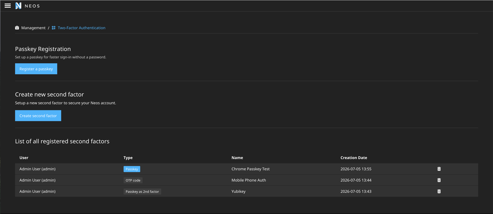

# Neos Backend 2FA

Extend the Neos backend login to support second factors and passwordless passkey login. We support
TOTP tokens (Authenticator apps) and WebAuthn / FIDO2 passkeys — both platform authenticators
(Touch ID, Windows Hello) and hardware security keys (e.g. Yubikey).

## What this package does

This package allows all users to register multiple second factors — either a user- and passwordless **Passkey**, or a second factor in addition to their username and password. Second factors can be **TOTP tokens** (Authenticator App) or **passkeys** (WebAuthn / FIDO2: a platform authenticator such as Touch ID or
Windows Hello, or a hardware key such as a Yubikey). Users can register multiple and pick which to
use at login. When passwordless login is enabled (see [Passwordless passkey login](#passwordless-passkey-login)),
a discoverable passkey can also be used to sign in straight from the login screen **without a
password**. 
As an Administrator you are able to delete factors for users again, in case they locked themselves out.

The management module distinguishes the two kinds of WebAuthn credential by a badge: a discoverable,
passwordless-capable credential is shown as **"Passkey"**, a non-discoverable one (usable only as a
second factor, e.g. a U2F-only key) as **"Passkey as 2nd factor"**.

### Passkeys (WebAuthn / FIDO2)

Browsers expose WebAuthn only over `https://` or on `localhost`. Make sure the Neos backend is served
over HTTPS in production, otherwise the passkey flow will fail. Note that an IP address (e.g.
`127.0.0.1`) cannot be used as the relying-party id — use `localhost` for local development.

Configure the relying party identifier when your backend hostname differs from the registered domain:

```yml
Sandstorm:
  NeosTwoFactorAuthentication:
    webAuthn:
      relyingPartyName: 'My CMS'
      # null means: derive from the request hostname (works for same-origin deployments).
      # Set to the registrable domain ('example.com') if you serve the backend from a subdomain
      # and want credentials to be usable across subdomains.
      relyingPartyId: null
      # Default is 'discouraged' so FIDO U2F-only authenticators (e.g. YubiKey 4) work
      # via the browser's U2F-compat fallback. Set to 'preferred' or 'required' to
      # demand PIN/biometric — note that 'required' excludes U2F-only keys.
      userVerification: 'discouraged'
      timeout: 60000
```

##### Local development over plain HTTP

WebAuthn requires a secure context. The browser treats `localhost` as secure, but the verification
library is stricter: it only exempts the **exact** host `localhost` from the HTTPS requirement, and
rejects any other host served over `http://` (including `localhost` subdomains such as
`myproject.localhost`) with `Invalid scheme. HTTPS required.`.

If your local backend runs over plain HTTP on a host other than `localhost`, list that host under
`securedRelyingPartyIds` to skip the HTTPS check for it:

```yml
Sandstorm:
  NeosTwoFactorAuthentication:
    webAuthn:
      # LOCAL DEVELOPMENT ONLY — never add a real production hostname here.
      # Relying-party ids listed here are treated as secured even without HTTPS.
      securedRelyingPartyIds:
        - 'myproject.localhost'
```

Keep this scoped to a development context (e.g. `Configuration/Development/Settings.yaml`). In
production the backend must be served over HTTPS and this setting should stay empty (the default).

#### Passwordless passkey login

<video controls src="docs/NeosTwoFactorAuth-PasskeyLogin.mov" title="Video of Login into Neos with Passkey"></video>

A discoverable passkey is inherently multi-factor (something you have + the verification you perform
on the device), so it can serve as the **only** login step. When enabled, a "Sign in with a passkey"
button appears on the Neos login screen and a single tap signs the user into the backend — no
username, no password.

This is **disabled by default** and must be turned on explicitly. The gate is enforced server-side
(the endpoints reject requests while disabled):

```yml
Sandstorm:
  NeosTwoFactorAuthentication:
    webAuthn:
      # Default false. When true: the login screen shows "Sign in with a passkey", and credentials
      # registered from then on are created as discoverable (resident) credentials with user
      # verification required — i.e. real "Passkeys". When false, WebAuthn credentials are
      # registered as non-discoverable "Passkey as 2nd factor" and the login button is not shown.
      passwordlessLoginEnabled: true
```

Notes:
- A passkey usable for passwordless login must be **discoverable** (resident) and user-verifying.
  Credentials registered while this setting was off, or on U2F-only keys (e.g. YubiKey 4), are
  non-discoverable and remain usable only as a second factor.
- The management module shows a "Register a passkey" banner nudging users who have no discoverable
  credential yet, so they can opt into faster sign-in.

#### Attestation

There is no setting for attestation. We always request the `none` conveyance preference, so the
browser does not return identifying attestation data about the authenticator. Only the `none` and
`fido-u2f` attestation statement formats are accepted when loading a credential (the latter is
required for U2F-only authenticators registered via the browser's U2F-compat fallback). Other
attestation statement types are not supported yet.

#### Authenticator compatibility

The first two columns describe registering a credential **as a second factor** (the effect of the
`userVerification` setting). The last column describes whether the authenticator can be used for
**passwordless login**, which always requires a discoverable (resident) credential with user
verification — independent of the `userVerification` setting.

| Authenticator                                     | 2nd factor — `userVerification: discouraged` | 2nd factor — `userVerification: required` | Passwordless passkey         |
| ------------------------------------------------- | -------------------------------------------- | ----------------------------------------- | ---------------------------- |
| YubiKey 5 / FIDO2 keys                            | ✅ touch                                      | ✅ PIN + touch                            | ✅ resident key + PIN/touch  |
| YubiKey 4 / older U2F-only keys                   | ✅ touch (U2F-compat)                         | ❌ not supported                          | ❌ no resident credentials   |
| Platform authenticators (Touch ID, Windows Hello) | ✅ biometric                                  | ✅ biometric                              | ✅ resident key + biometric  |

> When `passwordlessLoginEnabled` is on, **every** new registration requires a resident key + user
> verification, so U2F-only keys (e.g. YubiKey 4) can no longer be registered at all while it is
> enabled — turn it off if you need to enrol such a key as a second factor. Bear in mind that
> resident credentials also occupy a limited number of slots on hardware keys.



## Versioning Scheme

| Package Version | Neos / Flow Version | Released? | Supported | Remarks       |
| --------------- | ------------------- | --------- | --------- |---------------|
| 3.x             | 9.x, 8.x.           | ✅        | ✅        | `main` branch |
| 2.x             | 9.x, 8.x, 7.x       | ✅        |           | `main` branch |
| 1.x             | 9.x, 8.x, 7.x, 3.x  | ✅        |           |               |

## Settings

### Enforce 2FA

To enforce the setup and usage of 2FA you can add the following to your `Settings.yaml`.

```yml
Sandstorm:
  NeosTwoFactorAuthentication:
    # enforce 2FA for all users
    enforceTwoFactorAuthentication: true
```

With this setting, no user can login into the CMS without setting up a second factor first.


In addition, you can enforce 2FA for specific authentication providers and/or roles by adding following to your `Settings.yaml`

```yml
Sandstorm:
  NeosTwoFactorAuthentication:
    # enforce 2FA for specific authentication providers
    enforce2FAForAuthenticationProviders: ["Neos.Neos:Backend"]
    # enforce 2FA for specific roles
    enforce2FAForRoles: ["Neos.Neos:Administrator"]
```

### Issuer Naming

To override the default sitename as issuer label, you can define one via the configuration settings:

```yml
Sandstorm:
  NeosTwoFactorAuthentication:
    # (optional) if set this will be used as a naming convention for the TOTP. If empty the Site name will be used
    issuerName: ""
```

### TOTP leeway

By default, TOTP codes are verified against the current 30-second window only, with no tolerance for
clock drift between the user's device and the server. If users occasionally hit "invalid code"
errors near the boundary of a code's lifetime, you can allow some drift via:

```yml
Sandstorm:
  NeosTwoFactorAuthentication:
    # Acceptable TOTP clock drift in seconds. Codes from (now - leeway) through (now + leeway)
    # are accepted. 0 disables leeway (exact match only). MUST be lower than the 30s TOTP period;
    # values >= 30 are clamped to 29.
    totpLeewayInSeconds: 5
```

## Tested 2FA apps

Thx to @Sebobo @Benjamin-K for creating a list of supported and testet apps!

**iOS**:

- Google Authenticator (used for development) ✅
- Authy ✅
- Microsoft Authenticator ✅
- 1Password ✅

**Android**:

- Google Authenticator ✅
- Microsoft Authenticator ✅
- Authy ✅

## How we did it

- We introduced a new middleware `SecondFactorMiddleware` which handles 2FA on a Neos `Session` basis.
  - This is an overview of the checks the `SecondFactorMiddleware` does for any request:

    ```
                            ┌─────────────────────────────┐
                            │           Request           │
                            └─────────────────────────────┘
                                           ▼
                                ... middleware chain ...
                                           ▼
                            ┌───────────────────────────────┐
                            │  SecurityEntryPointMiddleware │
                            └───────────────────────────────┘
                                           ▼
            ┌───────────────────────────────────────────────────────────────────┐
            │                     SecondFactorMiddleware                        │
            │                                                                   │
            │  ┌─────────────────────────────────────────────────────────────┐  │
            │  │ 1. Skip, if no authentication tokens are present, because   │  │
            │  │    we're not on a secured route.                            │  │
            │  └─────────────────────────────────────────────────────────────┘  │
            │  ┌─────────────────────────────────────────────────────────────┐  │
            │  │ 2. Skip, if 'Neos.Backend:Backend' authentication token not │  │
            │  │    present, because we only support second factors for Neos │  │
            │  │    backend.                                                 │  │
            │  └─────────────────────────────────────────────────────────────┘  │
            │  ┌─────────────────────────────────────────────────────────────┐  │
            │  │ 3. Skip, if 'Neos.Backend:Backend' authentication token is  │  │
            │  │    not authenticated, because we need to be authenticated   │  │
            │  │    with the authentication provider of                      │  │
            │  │    'Neos.Backend:Backend' first.                            │  │
            │  └─────────────────────────────────────────────────────────────┘  │
            │  ┌─────────────────────────────────────────────────────────────┐  │
            │  │ 4. Skip, if second factor is not set up for account and not │  │
            │  │    enforced via settings.                                   │  │
            │  └─────────────────────────────────────────────────────────────┘  │
            │  ┌─────────────────────────────────────────────────────────────┐  │
            │  │ 5. Skip, if second factor is already authenticated.         │  │
            │  └─────────────────────────────────────────────────────────────┘  │
            │  ┌─────────────────────────────────────────────────────────────┐  │
            │  │ 6. Redirect to 2FA login, if second factor is set up for    │  │
            │  │    account but not authenticated.                           │  │
            │  │    Skip, if already on 2FA login route.                     │  │
            │  └─────────────────────────────────────────────────────────────┘  │
            │  ┌─────────────────────────────────────────────────────────────┐  │
            │  │ 7. Redirect to 2FA setup, if second factor is not set up for│  │
            │  │    account but is enforced by system.                       │  │
            │  │    Skip, if already on 2FA setup route.                     │  │
            │  └─────────────────────────────────────────────────────────────┘  │
            │  ┌─────────────────────────────────────────────────────────────┐  │
            │  │ X. Throw an error, because any check before should have     │  │
            │  │    succeeded.                                               │  │
            │  └─────────────────────────────────────────────────────────────┘  │
            └───────────────────────────────────────────────────────────────────┘
                                              ▼
                                     ... middlewares ...

    ```

- **Passwordless passkey login** is a separate, opt-in mechanism that does *primary* authentication —
  the middleware above is only a post-login gate. Because a Flow provider name maps to exactly one
  token class, we did not try to make the username/password provider also accept a passkey. Instead
  we added a parallel authentication provider + token (`WebAuthnPasswordlessProvider` /
  `WebAuthnPasswordlessToken`), registered with **no request pattern** and **no entry point**.
  - `PasswordlessLoginController` verifies the WebAuthn assertion, resolves the `Neos.Neos:Backend`
    account from the assertion's user handle (the account's persistence id), sets the parallel token
    to `AUTHENTICATION_SUCCESSFUL`, calls `securityContext->refreshTokens()` to persist it to the
    session, and marks the package's 2FA session status `AUTHENTICATED`.
  - It survives the redirect to `/neos` because `AuthenticationProviderManager` only re-runs
    providers for tokens that are `AUTHENTICATION_NEEDED`, and the Neos backend uses
    `authenticationStrategy: oneToken` — so a single authenticated token authenticates the request.
    `UserService::getCurrentUser()` resolves the Neos user from the *account's party* regardless of
    which provider authenticated it, so roles and the backend UI work normally.
  - A user-verified passkey is inherently multi-factor, so the 2FA gate is satisfied in one tap
    (passwordless login sets the 2FA session status `AUTHENTICATED`, which is check #5 above).
  - The "Sign in with a passkey" button is injected into the core Neos login screen by overriding
    `Neos.Neos:Component.Login.Form` (`renderer.@process`) plus a `Views.yaml` entry. The core login
    is rendered by a plain `FusionView` that does not apply `fusion.autoInclude` and has no script
    hook, so the (gated) button also emits its own `<script>` to load the ceremony JS. The XHR
    endpoints are reachable thanks to a `Policy.yaml` grant.

## When updating Neos, those part will likely crash:

- the login screen for the second factor is a hard copy of the login screen from the `Neos.Neos` package
  - just replaced the username/password form with the form for the second factor
  - maybe has to be replaced when neos gets updated
- the passwordless "Sign in with a passkey" button is injected into the **core** Neos login screen via
  a `Views.yaml` override (pointing at `resource://Neos.Neos/Private/Fusion/Backend`) plus a
  `@process` on `Neos.Neos:Component.Login.Form`. If Neos restructures its login Fusion or view
  configuration, this injection may need to be re-aligned.
- hopefully the rest of this package is solid enough to survive the next mayor Neos versions ;)

## Why not ...?

### Enhance the `UsernamePassword` authentication token

> This actually has been the approach up until version 1.0.5.

One issue with this is the fact, that we _want_ the user to be logged in with that token via the
`PersistedUsernamePasswordProvider`, but at the same time to _not be logged in_ with that token as long as 2FA is
not authenticated as well.
We found it hard to find a secure way to model the 2FA setup solution when 2FA is enforced, but the user does not have a
second factor enabled, yet.

The middleware approach makes a clear distinction between "Logging in" and "Second Factor Authentication", while still
being session based and unable to bypass.

### Set the authenticationStrategy to `allTokens`

The AuthenticationProviderManager requires to authorize all tokens at the same time otherwise, it will throw
an Exception (see AuthenticationProviderManager Line 181

```php
if ($this->authenticationStrategy === Context::AUTHENTICATE_ALL_TOKENS) {
    throw new AuthenticationRequiredException('Could not authenticate all tokens, but authenticationStrategy was set to "all".', 1222203912);
}
```

)

This leads to an error where the `AuthenticationProviderManager` throws exceptions before the user is able to enter any
credentials. The `SecurityEntryPointMiddleware` catches those exceptions and redirects to the Neos Backend Login, which
causes the same exception again. We get caught in an endless redirect.

The [Neos Flow Security Documentation](https://flowframework.readthedocs.io/en/stable/TheDefinitiveGuide/PartIII/Security.html#multi-factor-authentication-strategy)
suggests how to implement a multi-factor-authentication, but this method seems like it was never tested. At the moment of writing
it seems like the `authenticationStrategy: allTokens` flag is broken and not usable.

## Contributing

### Testing

The package ships with end-to-end tests built on [Playwright](https://playwright.dev) and written in Gherkin syntax via [playwright-bdd](https://vitalets.github.io/playwright-bdd/).

#### Running the tests

Tests require Docker and Node.js. All Makefile targets are run from `Tests/E2E/`. Run the initial setup once — it builds the SUT images and installs the test dependencies (if [nvm](https://github.com/nvm-sh/nvm) is available it will automatically switch to the Node version from `.nvmrc`):

```bash
make setup          # build SUT images + install test dependencies
make setup-test     # only install node dependencies, playwright and generate BDD files
```

Re-generate Playwright spec files whenever a `.feature` file changes:
```bash
make generate-bdd-files
```

Run the tests:

```bash
make test                   # run all tests (neos8 + neos9, all configurations)

make test-neos8             # run all neos8 tests
make test-neos8-defaults    # default configuration only
make test-neos8-enforce-all # enforceTwoFactorAuthentication: true
make test-neos8-enforce-role
make test-neos8-enforce-provider
make test-neos8-passwordless # webAuthn.passwordlessLoginEnabled: true

make test-neos9             # same targets for neos9 / PHP 8.5

make sut-prune              # tear down all docker compose environments and remove volumes
```

Run `make help` to see all available targets.

#### Debugging tests
To debug a test, run the test from `Tests/E2E/` with flags like this:

- `npm run test:neos8:enforce-all -- --debug` - to run the test in headed mode with Playwright Inspector
- `npm run test:neos8:enforce-all -- --ui` - to run the test in headed mode with Playwright Test Runner UI

If you just want to see the test running in the browser just `npm run test:neos8:enforce-all -- --headed`.

> While debugging you can also enter the SUT with `make enter-sut-neos8` and `make enter-sut-neos9` respectively.
>
> You can even the tests you want to debug with `npm run test:neos8:enforce-all -- --grep @debug` and adding the `@debug` tag to the scenario you want to debug. But using the --ui flag is usually more convenient for debugging.

#### System under test (SUT)

There are two docker compose environments in `Tests/system_under_test/`:

- `neos8/` — Neos with PHP 8.2
- `neos9/` — Neos with PHP 8.5

Both are built from the repository root as the Docker build context, so the local package source is copied into the container and installed via a Composer path repository. This means every test run tests the _current working tree_ of the package, not a published version.

#### Configuration variants

The `FLOW_CONTEXT` environment variable is passed into the docker compose environment via variable substitution, and Flow's hierarchical configuration loading picks up the corresponding `Settings.yaml` from the SUT:

| Playwright tag | `FLOW_CONTEXT` | What is tested |
|---|---|---|
| `@default-context` | `Production/E2E-SUT` | No enforcement — 2FA is optional |
| `@enforce-for-all` | `Production/E2E-SUT/EnforceForAll` | `enforceTwoFactorAuthentication: true` |
| `@enforce-for-role` | `Production/E2E-SUT/EnforceForRole` | Enforcement scoped to `Neos.Neos:Administrator` |
| `@enforce-for-provider` | `Production/E2E-SUT/EnforceForProvider` | Enforcement scoped to an authentication provider |
| `@passwordless` | `Production/E2E-SUT/Passwordless` | `webAuthn.passwordlessLoginEnabled: true` — passwordless passkey login |

#### Test isolation

Each scenario starts with a clean state. An `AfterScenario` hook runs after every scenario to:

1. Log the browser out via a POST to `/neos/logout`
2. Delete all Neos users (`./flow user:delete --assume-yes '*'`)

Deleting all users also cascades to their 2FA devices, so no separate cleanup step is needed. Users and devices are re-created by the Background steps at the start of each scenario.

#### Design decisions

**Gherkin / BDD over plain Playwright specs** — the feature files document the intended behaviour of each configuration variant at a level that is readable without knowing the implementation. The generated Playwright spec files (`.features-gen/`) are not committed; they are re-generated by `bddgen` before each test run.

**UI-only device enrolment** — 2FA devices are enrolled through the browser UI (the backend module or the setup page) rather than a dedicated CLI command. This avoids coupling the tests to internal persistence details and exercises the same enrolment path a real user would take. The `deviceNameSecretMap` in `helpers/state.ts` carries TOTP secrets across steps within a scenario (e.g. from the enrolment step to the OTP entry step).

**Sequential execution** — tests run with `workers: 1` and `fullyParallel: false` because all scenarios share a single running SUT container and a single database. Running them in parallel would cause interference between scenarios.

**User creation via `docker exec`** — Neos user creation is done through the Flow CLI (`./flow user:create`) rather than the UI because the UI path is not part of what this package tests, and using the CLI is faster and more reliable for setup.
